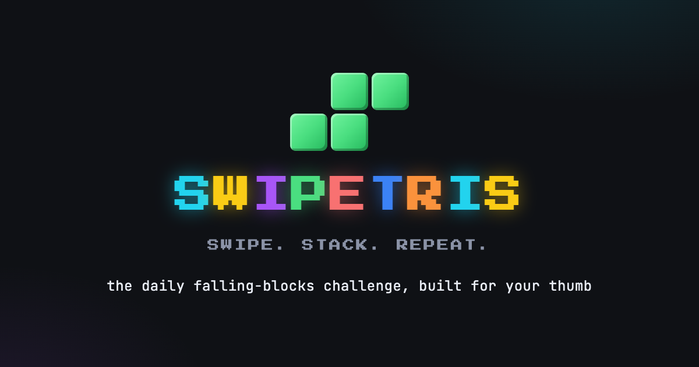

<p align="center">
  <a href="https://swipetris.com">
    
  </a>
</p>

<h1 align="center">swipetris</h1>

<p align="center">
  A gesture-first, daily-challenge falling-blocks game for the web.<br>
  <a href="https://swipetris.com"><strong>Play at swipetris.com</strong></a>
</p>

## What it is

Swipetris is a mobile-first PWA built around one-thumb controls:

- **Drag** to move
- **Tap** to rotate
- **Flick down** to drop
- Play the same seeded piece sequence as everyone else each day
- Submit your best run to the daily arcade leaderboard
- Install it to your home screen and play offline

There are no accounts, ads, cookies, or analytics. Only leaderboard requests touch the Swipetris server.

## Stack

- The game is rendered with [three.js](https://threejs.org/) in `public/app.js`
- The play UI uses [Alpine.js](https://alpinejs.dev/) in `public/play.html`
- Landing-page motion is mostly CSS; the phone demo is driven by `public/landing.js`
- Local development runs on [Bun](https://bun.sh/) and [Hono](https://hono.dev/)
- Production is static [Cloudflare Pages](https://pages.cloudflare.com/) plus dependency-free Pages Functions
- Scores are stored in [Turso](https://turso.tech/)

## Run locally

Requirements: [Bun](https://bun.sh/) 1.2 or newer.

```sh
git clone https://github.com/bitbonsai/swipetris.git
cd swipetris
bun install
bun run dev
```

Open <http://localhost:3000>. Without environment variables, the server creates a local `swipetris.db` SQLite database.

To use Turso instead:

```sh
cp .env.example .env
# Fill in TURSO_URL and TURSO_TOKEN
bun run dev
```

> **Careful:** a Turso-backed local server writes to that remote database. Use a development database unless you intentionally want to write to production.

## Test the Pages deployment locally

```sh
cp .env.example .env
bunx wrangler pages dev public
```

Wrangler serves `public/` and loads the routes in `functions/api/`. The Pages Functions intentionally use the raw libSQL HTTP API and have no npm imports; this repository has no production build step.

## Deploy

1. Create a Turso database and apply [`schema.sql`](schema.sql), for example with `turso db shell <database> < schema.sql`.
2. Create a Cloudflare Pages project connected to your fork.
3. Leave the build command empty and set the output directory to `public`.
4. Add `TURSO_URL` and `TURSO_TOKEN` in the Pages project settings.
5. Deploy the `main` branch.

Cloudflare discovers `functions/` automatically. Environment-variable changes only apply to new deployments.

## Project layout

```text
public/          Static site, game, PWA assets, and vendored browser libraries
functions/api/   Cloudflare Pages leaderboard endpoints
src/             Bun/Hono local development server and database schema
schema.sql       Production database bootstrap
```

## Leaderboard trust model

Scores are untrusted client input. The API validates payload shape, daily seeds, score plausibility, timing, and submission rate before storing a result. These checks discourage casual abuse; they are not cryptographic proof of gameplay. Production operators should also configure platform-level rate limiting and monitor anomalous scores.

See [`SECURITY.md`](SECURITY.md) for reporting vulnerabilities.

## Contributing

Bug reports and focused pull requests are welcome. Read [`CONTRIBUTING.md`](CONTRIBUTING.md) before opening a PR.

## License

Swipetris is released under the [MIT License](LICENSE). Vendored dependencies retain their own licenses; see [`THIRD_PARTY_NOTICES.md`](THIRD_PARTY_NOTICES.md).

This is an independent project and is not affiliated with or endorsed by The Tetris Company. Third-party names and trademarks belong to their respective owners.
